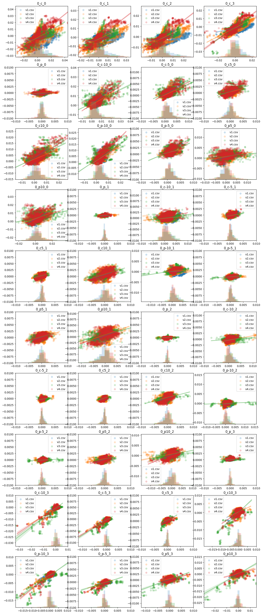
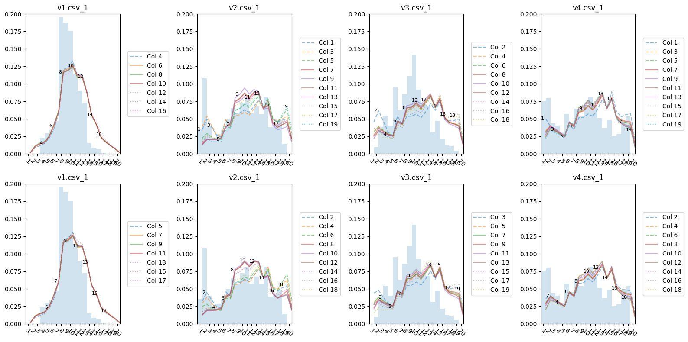

# tsprob
**Time Series Problem for Better Forecasting Solutions**

We are seeking improved models to forecast multivariate financial time series based on the enclosed dataset. If you're interested in contributing or experimenting with this problem, please contact me at **jerron@gmail.com**, and include your expectations or proposed approach.

---

## 📁 Data Description

The sample dataset for training, validation, and testing can be found here:

🔗 [Download Data](https://drive.google.com/drive/folders/1Kl_2ClW4QWT9jIeJR-M2k_l_sEm3pjyE?usp=sharing)

Each row in the tabular dataset contains **1072 fields**, and each field belongs to one of the following types:

### 1. Historical Values (Type 1)
Fields representing values from the previous 20 days, such as:
- `date_1`, `date_2`, ..., `date_20`
- `spot_1`, `spot_2`, ..., `spot_20`
- `dtm_0_1`, `dtm_0_2`, ..., `dtm_0_20`
- `c_0_1`, `c_0_2`, ..., `c_0_20`

### 2. Current Observation (Type 2)
Fields representing values at the current observation, such as:
- `date`, `e2d`, `dtm_0`

Note: Among these, 4 fields contain underscores ( `_` ) but are still Type 2 — **do not confuse them with Type 1**:
- `dtm_0`
- `dtm_1`
- `dtm_2`
- `dtm_3`

### 3. First Differences from Previous Day (Type 3)
Fields representing the difference between the current observation and the previous day, such as:
- `spot`, `hi`, `c_0`

    ### 3+. Extended Difference Fields (Type 3+)
    A subset of Type 3 fields (40 in total) also include underscores in their names. Again, **do not confuse these with Type 1**. These include:

    | c_0 | p_0 | c-10_0 | c-5_0 | c5_0 | c10_0 | p-10_0 | p-5_0 | p5_0 | p10_0 |
    |-----|-----|--------|-------|------|-------|--------|-------|------|--------|
    | c_1 | p_1 | c-10_1 | c-5_1 | c5_1 | c10_1 | p-10_1 | p-5_1 | p5_1 | p10_1 |
    | c_2 | p_2 | c-10_2 | c-5_2 | c5_2 | c10_2 | p-10_2 | p-5_2 | p5_2 | p10_2 |
    | c_3 | p_3 | c-10_3 | c-5_3 | c5_3 | c10_3 | p-10_3 | p-5_3 | p5_3 | p10_3 |

### 4. Category Label (pmcat)
The `pmcat` field is a label assigned to each observation, representing one of **20 ordered classes**.

- This is the **only field** that does not have associated historical values (Type 1).
- It is an **ordered classification** task. For example, if the true class is 10, then a prediction of 9 or 11 is preferred over predictions further away.

---

## 🎯 Task Objectives

We aim to solve two forecasting problems:

### 1. Forecast Type 3+ Fields (Regression)
- **Input**: Type 1 fields and current values `date`, `e2d`, `spot`, `dtm_0`
- **Output**: Forecast the 40 Type 3+ fields
- **Preference**: Underestimation is preferred over overestimation

Example result (forecast vs actual):

---

### 2. Forecast `pmcat` (Ordered Classification)
- **Input**: Type 1 fields and current values `date`, `e2d`
- **Output**: Forecast the class probabilities for all 20 possible `pmcat` classes
- **Requirement**: Output should be a probability distribution over the 20 classes

Example result (each line represents average predicted probability for one true class):

> Because this is an **ordered classification**, predictions closer to the true class are preferred. For example, if the true class is 15, predicting 14 or 16 is better than predicting 5 or 20.
